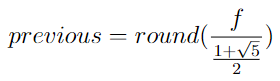
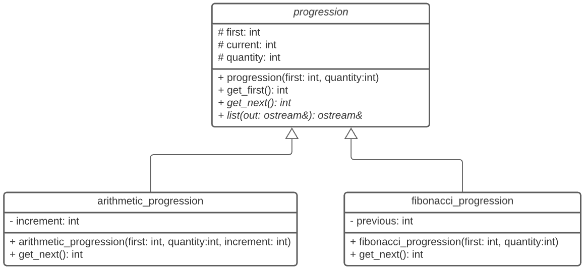

# PC #3 - 2020-2 - Lab 206

Practica Calificada # 3 del curso de Programación Orientada a Objetos 1

## Indicaciones Especificas
- El tiempo límite para la evaluación es 100 minutos.
- Las preguntas deberá ser respondida en un archivo fuente (`.cpp`) y un archivo cabecera (`.h`) con el número de la pregunta:
    - `p1.cpp, p1.h`
- Deberás subir estos archivos directamente a [www.gradescope.com](https://www.gradescope.com) o se puede crear un `.zip` que contenga todos ellos y subirlo.

## Competencias
- Para los alumnos de la carrera de Ciencia de la Computación
    - Aplicar conocimientos de computación y de matemáticas apropiadas para la disciplina. **(Evaluar)**
    - Analizar problemas e identificar y definir los requerimientos computacionales apropiados para su solución. **(Usar)**
    - Utilizar técnicas y herramientas actuales necesarias para la práctica de la computación. **(Usar)**

- Para los alumnos de las carreras de Ingeniería
    - Capacidad de aplicar conocimientos de matemáticas **(nivel 3)**
    - Capacidad de aplicar conocimientos de ingeniería **(nivel 2)**
    - Capacidad para diseñar un sistema, un componente o un proceso para satisfacer las necesidades deseadas dentro de restricciones realistas. **(nivel 2)**

## Ejercicio #1 - Progresiones

### Problem Statement
Escribir un programa que utilizando la clase `progression` y sus clases derivadas `arithmetic_progression` y `fibonacci_progression` genere un vector polimorfico de progresiones de números arítmeticos o fibonacci, el programa solicitará primero la cantidad `m` de progresiones y una cantidad `n` de números que se generara por cada progresión y que se almacenará en el atributo `quantity`, luego debe solicitar por cada progresión el tipo (A=Arithmetic, F=Fibonacci) el valor inicial y en el caso de progresión aritmetica el incremento.  
El programa debe de retornar por cada progresión los `n` números utilizando el operador sobrecargado `<<`:

```cpp
ostream& operator<<(ostream& out, vector<progression*> v);
```

Para obtener el valor previo al primer número fibonacci se sugiere utilizar la siguiente formula:





### Input Format
```cpp
    2 10
    A 1 3
    F 8
```
### Constraints
```bash
- No utilizar etiquetas
- Numeros enteros
```
### Output Format
```bash
    1 4 7 10 13 16 19 22 25 28
    8 13 21 34 55 89 144 233 377 610
```

### Example #2
```cpp
    3 5
    A 2 3
    F 21
    A 10 1
```
### Output Format
```bash
    2 5 8 11 14
    21 34 55 89 144
    10 11 12 13 14
```
